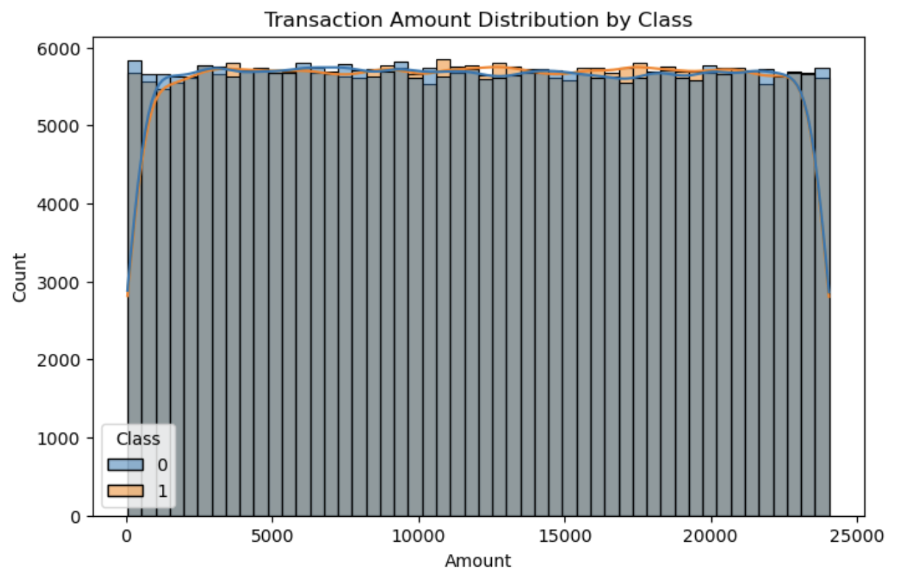
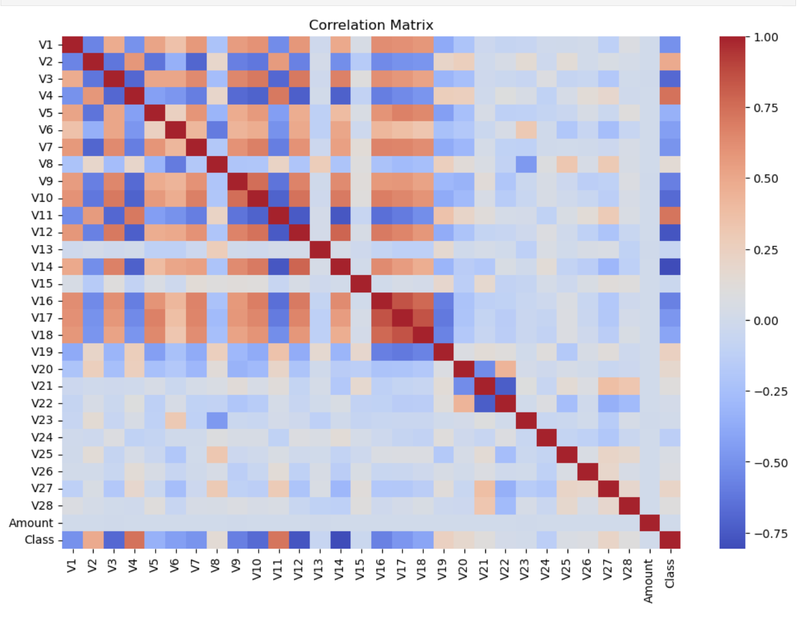
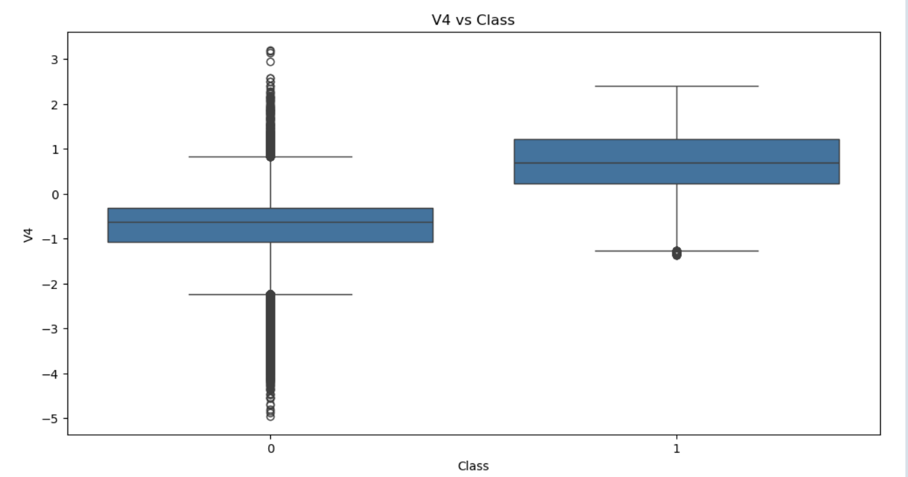
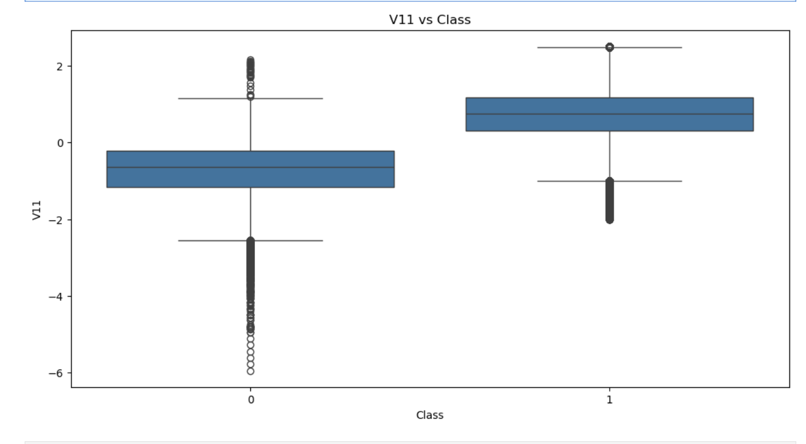
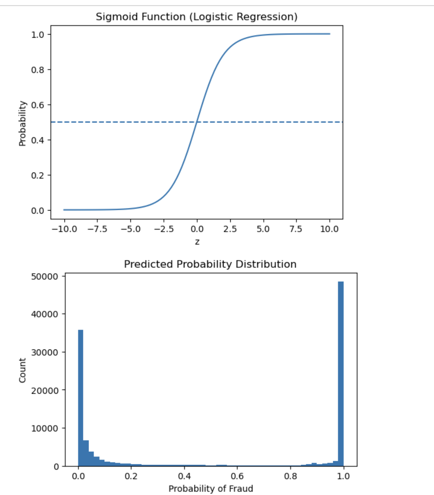
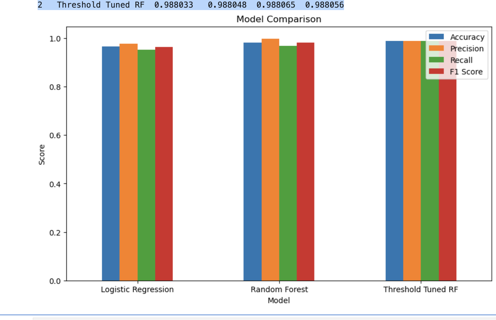

# 🛡️ Credit Card Fraud Detection using Machine Learning

<div align="center">


**A production-ready machine learning pipeline that detects fraudulent credit card transactions with 98.8% accuracy — stopping 988 out of every 1,000 fraud attempts.**

</div>

---

## 📌 Table of Contents

- [Overview](#-overview)
- [Dataset](#-dataset)
- [Exploratory Data Analysis](#-exploratory-data-analysis)
- [Hypothesis Testing](#-hypothesis-testing)
- [Model Pipeline](#-model-pipeline)
- [Results & Comparison](#-results--comparison)
- [Key Insights](#-key-insights)
- [Project Structure](#-project-structure)
- [Getting Started](#-getting-started)
- [Challenges](#-challenges-faced)
- [Conclusion](#-conclusion)

---

## 🔍 Overview

In modern finance, a transaction is processed in milliseconds — but within that window, fraud can slip through undetected. This project builds a **Digital Guardian**: an end-to-end machine learning system trained to identify the subtle behavioral fingerprints of fraudulent transactions across **568,630 real-world records**.

The system evolves through three progressively powerful models, culminating in a **Threshold-Tuned Random Forest** that achieves near-perfect detection rates with minimal false alarms.

---

## 📊 Dataset

| Property | Detail |
|---|---|
| **Source** | `creditcard_2023.csv` |
| **Total Transactions** | 568,630 |
| **Features** | 31 (V1–V28 via PCA, + Amount, Class) |
| **Class Balance** | 50/50 (284,315 fraud / 284,315 legitimate) |
| **Missing Values** | None ✅ |
| **Data Types** | Float64 (29), Int64 (2) |

> ⚠️ **Note:** Features V1–V28 are **PCA-transformed** for privacy. Raw transaction details (merchant, location, cardholder name) are not available.

```python
df.info()
# RangeIndex: 568630 entries
# 31 columns — No null values
# Memory usage: 134.5 MB
```

---

## 📈 Exploratory Data Analysis

### Class Distribution
The dataset is perfectly balanced — an ideal setup for learning the "DNA" of fraud without bias toward the majority class.

```
Class 0 (Legitimate): 284,315
Class 1 (Fraud):      284,315
```

### Transaction Amount Analysis

> *"Does transaction amount reveal fraud?"*

Fraud and legitimate transactions share **almost identical amount distributions** — fraud is spread across all ranges with no concentration at high or low values. The `Amount` feature alone is **not a reliable fraud indicator**.



### Correlation Analysis

> *"Which features actually matter?"*



Most features show **weak individual correlations** with fraud, confirming that fraud detection requires understanding **combined feature interactions** rather than single signals.

**Top 10 features correlated with fraud:**

| Rank | Feature | Correlation |
|------|---------|------------|
| 1 | V4 | 0.7360 |
| 2 | V11 | 0.7243 |
| 3 | V2 | 0.4919 |
| 4 | V19 | 0.2441 |
| 5 | V27 | 0.2140 |
| 6 | V20 | 0.1799 |
| 7 | V8 | 0.1443 |
| 8 | V21 | 0.1096 |
| 9 | V28 | 0.1020 |
| 10 | V26 | 0.0711 |

### Feature Behaviour: V4 vs V11

Boxplot analysis reveals **clear separation** between fraud and legitimate classes for both V4 and V11 — confirming their power as predictive features.

| V4 Analysis | V11 Analysis |
|-------------|-------------|
|  |  |

---

## 🧪 Hypothesis Testing

Before model building, statistical significance of key features was formally validated.

### V4 Feature Test
| | Value |
|--|--|
| **H₀** | No difference in V4 between fraud and legitimate transactions |
| **H₁** | There IS a statistically significant difference |
| **T-Statistic** | `819.77` |
| **P-Value** | `0.0` ✅ |
| **Result** | **Reject H₀** — V4 is a highly significant predictor |

### V11 Feature Test
| | Value |
|--|--|
| **T-Statistic** | `792.10` |
| **P-Value** | `0.0` ✅ |
| **Result** | **Reject H₀** — V11 is a highly significant predictor |

> Both features show **statistically significant** differences between fraud and legitimate transactions, confirming their inclusion in the model.

---

## 🤖 Model Pipeline

The system evolves through **three stages**, each improving on the last.

```
 Stage 1                Stage 2               Stage 3
┌─────────────┐      ┌──────────────┐      ┌─────────────────────┐
│  Logistic   │  →   │    Random    │  →   │  Threshold-Tuned    │
│ Regression  │      │    Forest    │      │    Random Forest    │
│  Baseline   │      │   Ensemble   │      │    Optimized        │
│  96.5% Acc  │      │   98.3% Acc  │      │    98.8% Acc ✅     │
└─────────────┘      └──────────────┘      └─────────────────────┘
```

---

### Stage 1 — Logistic Regression (Baseline)

A fast, interpretable model to establish performance benchmarks.

```python
from sklearn.linear_model import LogisticRegression

model = LogisticRegression()
model.fit(X_train, y_train)
```

**Results:**

```
              precision    recall  f1-score   support
           0       0.95      0.98      0.97     56750
           1       0.98      0.95      0.96     56976
    accuracy                           0.97    113726
```

| Metric | Score |
|--------|-------|
| Accuracy | 96.5% |
| Precision (Fraud) | 97.7% |
| Recall (Fraud) | 95.2% |
| False Negatives | **2,699** ⚠️ |

> In banking, 2,699 missed fraud cases is not acceptable. We need to do better.



---

### Stage 2 — Random Forest (Ensemble Power)

A forest of decision trees to capture non-linear, complex patterns.

```python
from sklearn.ensemble import RandomForestClassifier

rf_model = RandomForestClassifier(
    n_estimators=20,
    max_depth=10,
    random_state=42,
    n_jobs=-1
)
rf_model.fit(X_train, y_train)
```

**Results:**

```
              precision    recall  f1-score   support
           0       0.97      1.00      0.98     56750
           1       1.00      0.97      0.98     56976
    accuracy                           0.98    113726
```

| Metric | Score |
|--------|-------|
| Accuracy | 98.3% |
| Precision (Fraud) | **100%** 🎯 |
| Recall (Fraud) | 96.7% |
| False Negatives | **1,838** (↓ 32% from LR) |

**Top Feature Importances (Random Forest):**

> V14 and V10 emerge as the strongest contributors — aligning with EDA findings on V4 and V11.


---

### Stage 3 — Threshold-Tuned Random Forest (The Sweet Spot)

**The insight:** A 50% decision threshold is too lenient. By lowering the threshold to **0.3**, the model flags anything even *slightly* suspicious.

```python
# Get fraud probabilities
y_prob_rf = rf_model.predict_proba(X_test)[:, 1]

# Lower the detection threshold
threshold = 0.3
y_pred_new = (y_prob_rf >= threshold).astype(int)
```

**Results:**

```
              precision    recall  f1-score   support
           0       0.99      0.99      0.99     56750
           1       0.99      0.99      0.99     56976
    accuracy                           0.99    113726
```

| Metric | Score |
|--------|-------|
| Accuracy | **98.8%** |
| Precision (Fraud) | 98.8% |
| Recall (Fraud) | **98.8%** 🏆 |
| False Negatives | **680** (↓ 63% from Stage 2) |

> The trade-off is intentional: a small increase in false positives (from 78 → 681) is acceptable because **catching fraud always outweighs a manual review**.

---

## 📊 Results & Comparison

| Model | Accuracy | Precision | Recall | F1 Score |
|-------|----------|-----------|--------|----------|
| Logistic Regression | 96.52% | 97.74% | 95.26% | 96.48% |
| Random Forest | 98.32% | 99.86% | 96.77% | 98.29% |
| **Threshold Tuned RF** | **98.80%** | **98.80%** | **98.80%** | **98.81%** |



> 🏆 The **Threshold-Tuned Random Forest** delivers the most balanced and highest scores across all metrics — the clear winner for production deployment.

---

## 💡 Key Insights

- **Transaction amount is NOT a reliable fraud signal** — fraudsters operate across all amount ranges
- **V4 and V11** are the strongest individual predictors (t-statistics of 819 and 792 respectively)
- **Fraud detection is multi-dimensional** — no single feature separates fraud; the model leverages combined interactions
- **Threshold tuning** is a low-effort, high-reward optimization that reduced false negatives by **63%**
- **Recall > Precision** in fraud detection: a missed fraud = real financial loss; a false alert = a quick review call

---

## 📁 Project Structure

```
Credict-card-fraud-detection-using-Machine-Learning-/
│
├── 📓 notebook.ipynb              # Full analysis notebook
├── 📄 README.md                   # Project documentation
│
└── 📂 images/                     # All chart exports
    ├── chart1.png                 # Class distribution
    ├── chart2.png                 # Amount distribution
    ├── chart3.png                 # Correlation heatmap
    ├── chart4.png                 # V4 boxplot
    ├── chart5.png                 # V11 boxplot
    ├── chart7.png                 # ROC curve (LR)
    ├── chart8.png                 # Precision vs Recall
    ├── chart9.png                 # LR visualizations
    ├── chart10.png                # Sigmoid function
    ├── chart11.png                # RF confusion matrix
    ├── chart12.png                # RF ROC curve
    ├── chart13.png                # Feature importance
    ├── chart14.png                # Model comparison
    ├── chart15.png                # Decision tree viz
    └── CHART6.png                 # Probability distribution
```

---

## 🚀 Getting Started

### Prerequisites

```bash
pip install pandas numpy scikit-learn seaborn matplotlib scipy
```

### Run the Notebook

```bash
git clone https://github.com/Kushala125/Credict-card-fraud-detection-using-Machine-Learning-.git
cd Credict-card-fraud-detection-using-Machine-Learning-

# Add your dataset
# Place creditcard_2023.csv in the root directory

# Open the notebook
jupyter notebook
```

### Quick Start (Core Pipeline)

```python
import pandas as pd
from sklearn.ensemble import RandomForestClassifier
from sklearn.model_selection import train_test_split
from sklearn.preprocessing import StandardScaler

# Load & prep
df = pd.read_csv("creditcard_2023.csv").drop("id", axis=1)
df["Amount"] = StandardScaler().fit_transform(df[["Amount"]])

X = df.drop("Class", axis=1)
y = df["Class"]
X_train, X_test, y_train, y_test = train_test_split(X, y, test_size=0.2, random_state=42)

# Train
model = RandomForestClassifier(n_estimators=20, max_depth=10, random_state=42, n_jobs=-1)
model.fit(X_train, y_train)

# Predict with optimized threshold
y_prob = model.predict_proba(X_test)[:, 1]
y_pred = (y_prob >= 0.3).astype(int)  # Tuned threshold
```

---

## ⚠️ Challenges Faced

**1. The Privacy Wall**
Features V1–V28 are PCA-transformed to protect cardholder privacy. This means we work with abstract mathematical patterns rather than human-readable signals like location or merchant category — making interpretation and explainability harder.

**2. The False Alarm Balance**
The core tension in fraud detection: catching more fraud risks flagging more legitimate transactions. Our threshold-tuned model found the **sweet spot** — dramatically improving recall while keeping false positives at a manageable level for manual review.

**3. Computational Efficiency**
Training on 568K+ records requires balancing model complexity with training time. The Random Forest was tuned (`n_estimators=20`, `max_depth=10`) to maintain performance while being computationally feasible.

---

## ✅ Conclusion

This project demonstrates that a thoughtfully evolved ML pipeline — from baseline logistic regression through ensemble methods to threshold optimization — can build a genuinely reliable fraud detection system.

**The Final Score:**

| Metric | Result |
|--------|--------|
| Transactions Analyzed | 568,630 |
| Test Set Size | 113,726 |
| Fraud Detected | 98.8% |
| Fraud Missed | 1.2% |
| For every 1,000 fraud attempts | **988 stopped** 🛡️ |

> Data-driven defense is our best weapon against financial crime. By understanding the *behavior* of fraud — not just its surface patterns — we built a system that protects digital assets at scale.

---

## 👤 Author

**Kushala125**
- GitHub: [@Kushala125](https://github.com/Kushala125)

---

<div align="center">

**⭐ If this project helped you, please give it a star!**

*Built with Python • scikit-learn • Pandas • Seaborn*

</div>
